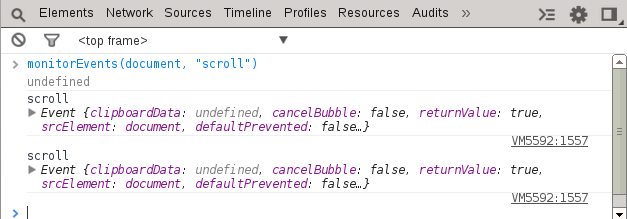

Monitor Events
==============

From the console you can usefully monitor events with the `monitorEvents` API. The API takes an object to be monitored and then an event to listen for. For example:

```javascript
monitorEvents(document, ["scroll"]);
monitorEvents($('#action-button'), ["mousedown", "mouseup"]);
```



To stop monitoring events, simply call `unmonitorEvents()` passing the object to stop monitoring on.

```javascript
unmonitorEvents(document);
```

####Exercise
Monitor the scroll event on the following element textfield
<textarea cols=80 rows=6>
	On the other hand, we denounce with righteous indignation and dislike men who are so beguiled and demoralized by the charms of pleasure of the moment, so blinded by desire, that they cannot foresee the pain and trouble that are bound to ensue; and equal blame belongs to those who fail in their duty through weakness of will, which is the same as saying through shrinking from toil and pain. These cases are perfectly simple and easy to distinguish. In a free hour, when our power of choice is untrammelled and when nothing prevents our being able to do what we like best, every pleasure is to be welcomed and every pain avoided. But in certain circumstances and owing to the claims of duty or the obligations of business it will frequently occur that pleasures have to be repudiated and annoyances accepted. The wise man therefore always holds in these matters to this principle of selection: he rejects pleasures to secure other greater pleasures, or else he endures pains to avoid worse pains.
</textarea>